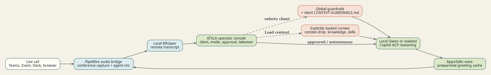

# ATSLA Technical Reference

This guide covers the local development and operations details for ATSLA | Support Live Agent. Start with `README.md` for the product overview and operator workflow.

## Architecture



ATSLA supervises six local services:

| Service | Responsibility |
| --- | --- |
| API | Fastify control plane and desktop dashboard on `127.0.0.1:4173`. |
| Desktop | Electron operator console. |
| Audio bridge | Creates and removes PipeWire virtual devices on Linux. |
| Transcription | FFmpeg segment capture plus local `whisper.cpp`. |
| Reasoning | Local Qwen or authenticated GitHub Copilot CLI through ACP. |
| Voice | Local AppaTalks/Chatterbox speech synthesis service. |

Use the supervisor rather than starting those processes manually:

```bash
npm run app:start
npm run app:status
npm run app:stop
```

Logs default to `~/.local/state/voice-bridge/`. The supervisor owns its children and removes Linux virtual audio modules during shutdown.

## Installation

For a public release, use the bootstrap shown in [README.md](README.md). It clones ATSLA to `~/.local/share/atsla-support-live-agent`, runs the versioned installer, creates the `atsla` launcher, and creates a Linux desktop entry.

```bash
curl -fsSL https://raw.githubusercontent.com/appatalks/atsla-support-live-agent/main/get-atsla.sh | bash
atsla
```

For a checked-out repository, use the same installer directly:

```bash
bash tools/install.sh
atsla
```

For live Linux operation, provide PipeWire/PulseAudio compatibility tools (`pactl`, `pw-cat`, and FFmpeg), a local `whisper.cpp` checkout and model, the authorized AppaTalks reference WAV, and either a local Qwen model service or an authenticated `copilot` CLI. Use `.env.example` as the configuration reference. Do not commit a populated `.env` file.

The installer supports `--skip-voice`, `--skip-whisper`, and `--no-launcher` for development or staged setup. `atsla status`, `atsla stop`, and `atsla update` manage an installed checkout.

## Audio Routing

On Linux, ATSLA creates two dedicated sinks:

| Name | Role |
| --- | --- |
| `voice_bridge_conference` | Communication-app speaker target. Its monitor is the remote-call capture source. |
| `voice_bridge_agent` | Agent-only speech target. Its monitor is the virtual agent microphone for the call. |

The conference and agent monitors are both looped to the physical operator output. The agent monitor is never mixed back into conference capture, preventing agent speech from being transcribed as remote audio. The physical operator microphone remains independent from the agent microphone.

Use the **Operator mic** / **Agent mic** control in the desktop application to choose which source the communication client receives. Run `Wire call` after joining or reconnecting a browser-based call.

```bash
npm run audio:dry-run
npm run audio:status
```

On macOS, configure a virtual output device such as BlackHole and set `VOICE_BRIDGE_MAC_AGENT_DEVICE`. Linux routing scripts are not used on macOS.

## Transcription

The segment runner captures `voice_bridge_conference.monitor` into four-second, 16 kHz mono WAV files. A volume gate skips silent input before local Whisper processing. Consecutive speech segments are combined and posted as one remote turn when the next below-threshold segment marks a pause, keeping the conversation timeline and model context aligned with natural utterances. Semantic non-speech events such as silence, throat clearing, or punctuation-only transcripts are documented without model generation or speech.

```bash
npm run whisper:bootstrap:dry-run
bash tools/bootstrap-whisper.sh

export WHISPER_BIN="$PWD/vendor/whisper.cpp/build/bin/whisper-cli"
export WHISPER_MODEL="$PWD/vendor/whisper.cpp/models/ggml-base.en.bin"
bash tools/transcribe-stream.sh --check
```

Set `VOICE_BRIDGE_SILENCE_DB` to adjust the volume gate. The bootstrap script attempts CUDA when available and falls back to CPU unless `WHISPER_CUDA=true` requires GPU support.

## Client Workspaces And Sessions

A client workspace includes:

```text
client-profile.json
knowledge/
skills/
learnings/
meetings/
```

Only explicitly loaded content from `client-profile.json`, `knowledge/`, `skills/`, and `learnings/` may enter a model prompt. The `meetings/` directory is never used as model context.

Sessions are persisted under `~/.local/share/voice-bridge/sessions/` and include their client workspace identifier. The application lists, opens, and renames only sessions belonging to the selected workspace. Starting a session requires a selected client workspace and always sends the Standard Greeting once. Switching workspaces persists the prior session, clears live transcript/drafts/escalations, unloads client context, and starts with an empty session list when that client has no prior sessions.

When enabled, remote observations and generated summaries are stored under the selected client's `learnings/` directory. Verbatim transcript and summary files are stored under `meetings/` only when their respective retention options are enabled.

Global documentation is separate from client data. Configure it in **Settings** and keep its root distinct from every client workspace.

### Bulk Context And Guardrails

New workspaces include `context-drop/`, an operator-friendly bulk import area. ATSLA recursively reads reviewed `.md`, `.txt`, `.json`, `.csv`, `.yaml`, and `.yml` files there after the operator explicitly loads the selected client context. It does not inspect `meetings/`, and it does not load a client workspace merely because it is selected.

Use `context-drop/CONTEXT-GUARDRAILS.md` for client-specific policy. Write clear sections for **May Discuss**, **Sensitive Or Restricted**, and **Required Behavior**. Describe what to decline, what to escalate, and the safe alternative to provide. This file is loaded before the client reference material.

For organization-wide policy, create `GLOBAL-GUARDRAILS.md` at the root of the Global shared knowledge folder. Use [docs/GLOBAL-GUARDRAILS.template.md](docs/GLOBAL-GUARDRAILS.template.md) as a starting point. Global guardrails are included for every session and take precedence over client guardrails. Reference files cannot override either level.

Best practices:

- Keep each file focused, short, and reviewed; use descriptive filenames and headings.
- Put public product facts and support procedures in normal reference files; put disclosure limits in guardrail files.
- Prefer data extracts that omit credentials, unnecessary personal data, and raw production exports.
- State an escalation path for authorization, pricing, legal, security, and account-specific requests.
- Review `learnings/` before promoting observations into durable client reference material.
- Keep real client folders outside the git repository. The committed `demo-client-folder/` is fictional and safe to use for evaluation.

## Provider Isolation

Local Qwen receives only the current request transcript and explicit application context. GitHub Copilot CLI is launched through `tools/copilot-no-memory.sh` and `tools/stateless_acp_bridge.py`:

- Copilot resume, continuation, session-ID, and memory options are rejected.
- Custom instructions, built-in MCPs, remote control, and durable request logs are disabled.
- EVA cognition, persistent memory, telemetry, memory injection, and post-response reflection are disabled.
- Every completion creates a fresh ACP session.

This keeps ATSLA as the authority for client context and prevents Copilot conversation history from crossing clients.

For the installed application, configure the EVA ACP bridge path in `~/.config/voice-bridge/env` when EVA is not a sibling checkout:

```bash
EVA_ACP_BRIDGE_SCRIPT=/path/to/eva-agent/tools/acp_bridge.py
```

Restart ATSLA after changing this file. The **GitHub Copilot CLI** provider is shown as offline until its authenticated local ACP bridge is running on `127.0.0.1:8888`.

## Response Modes

| Mode | Behavior |
| --- | --- |
| Monitor | Listens, displays, and optionally records; no model response or speech. |
| Approve | Generates a draft and waits for operator authorization. |
| Autonomous | Generates and speaks after the configured end-of-turn delay. |

Live-representative requests cancel pending autonomous work and retain an operator alert until acknowledged or taken over. The agent can return `[[NO_RESPONSE]]` for silence, noise, incomplete fragments, or turns that do not need a useful contribution; this is never spoken.

## Voice Output

The local AppaTalks profile uses Chatterbox speech synthesis. The AppaTalks Standard Greeting is packaged as a fingerprint-validated seed cache, so a matching authorized reference can start without regenerating it; replacing the reference safely triggers a fresh synthesis. Settings include an Eva profile that uses the bundled Eva reference voice and Eva's warm, curious, direct conversational style. Set `EVA_VOICE_REFERENCE` to replace that source later. Settings expose per-profile expression (`exaggeration`) and pacing (`cfg_weight`) controls. The original Chatterbox model does not support Turbo paralinguistic tags, so ATSLA uses natural punctuation and wording instead.

Voice output is sent only to the `voice_bridge_agent` sink on Linux. The operator can monitor it through the physical-output loopback.

## Console Appearance

The **Appearance** settings tab provides four persistent console themes:

| Theme | Intent |
| --- | --- |
| ATSLA signal | Default midnight-blue console with cyan, periwinkle, and rose accents drawn from the ATSLA visual identity. |
| Atelier glass | Default light operational console with translucent panels. |
| LCARS command | Star Trek-inspired command palette with high-contrast structural color. |
| Terminal monochrome | Green phosphor terminal styling for dense operational work. |
| Dark operations | Restrained dark console for low-light environments. |

Use **Glass transparency** to balance the layered background against dense text. Theme and transparency changes preview immediately and are saved with the operator settings. The settings drawer is organized into **Workspace**, **Agent**, **Voice**, and **Appearance** tabs.

## HTTP API

| Endpoint | Purpose |
| --- | --- |
| `GET /health` | Service readiness and active provider/voice details. |
| `GET /v1/settings` | Read persisted operator settings. |
| `PUT /v1/settings` | Update operator settings. |
| `POST /v1/client-workspace` | Select or create a client workspace. |
| `POST /v1/context/load` | Explicitly load the selected client's model context. |
| `POST /v1/context/clear` | Clear active client context. |
| `GET /v1/sessions` | List sessions for the selected client workspace only. |
| `POST /v1/sessions` | Start a selected-client session and send the Standard Greeting. |
| `POST /v1/transcripts` | Submit a transcript event. |
| `POST /v1/drafts` | Generate a draft response. |
| `POST /v1/drafts/:draftId/authorize` | Speak an approved draft. |
| `POST /v1/meeting-summary` | Generate and optionally persist a meeting summary. |
| `POST /v1/stop` | Cancel queued agent output. |

## Validation

```bash
npm test
npm run typecheck
npm run simulate
```

Before a live customer call, verify device routing, operator monitoring, microphone selection, speech output, disclosure language, retention settings, and manual takeover on the target communication client.