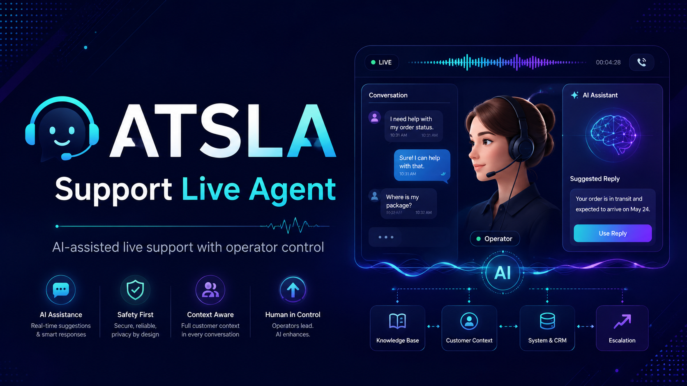

# ATSLA | Support Live Agent



[Technical guide](README-2.md) | [Demo client](demo-client-folder) | [Issues](https://github.com/appatalks/atsla-support-live-agent/issues)

ATSLA is a local, operator-controlled AI support agent for live customer conversations. It listens to call audio, applies explicit global and client guardrails, and speaks through the AppaTalks voice profile when the operator authorizes or enables autonomous participation.

## Public Quick Install

Once the repository is public, install ATSLA with one command:

```bash
curl -fsSL https://raw.githubusercontent.com/appatalks/atsla-support-live-agent/main/get-atsla.sh | bash
```

Then launch ATSLA:

```bash
atsla
```

The installer creates an `atsla` command and, on Linux, a desktop application entry. Use `atsla status`, `atsla stop`, and `atsla update` for everyday operation. The first installation checks required local audio, transcription, voice, and model dependencies; it reports any missing system prerequisite before changing the audio graph.

Or clone manually:

```bash
git clone https://github.com/appatalks/atsla-support-live-agent.git
cd atsla-support-live-agent
bash tools/install.sh
atsla
```

## What You Get

| | |
| --- | --- |
| **Live call bridge** | PipeWire call capture, isolated agent microphone, and local operator monitoring. |
| **AppaTalks voice** | Local voice synthesis with a prewarmed Standard Greeting. |
| **Operator control** | Monitor, approve, autonomous, mute, takeover, and live-representative escalation controls. |
| **Client isolation** | Separate sessions, explicit context loading, and no Copilot cross-client memory. |
| **Guardrails** | Global and per-client disclosure, sensitivity, and escalation rules take precedence over reference material. |
| **Local reasoning** | Local Qwen or authenticated GitHub Copilot CLI reasoning. |

## Get Started

1. Launch `atsla` and join the call.
2. Select or create a client workspace.
3. Use **Open folder** to add approved files to `context-drop/` and define `CONTEXT-GUARDRAILS.md`.
4. Select **Load context**, then start a session. ATSLA sends the Standard Greeting once.
5. Choose Monitor, Approve, or Autonomous mode. Use takeover whenever a person should resume the conversation.

Try the fictional [demo-client-folder](demo-client-folder) first. Real client data belongs outside this repository.

## Privacy

ATSLA is an operator tool, not an unattended participant. Inform participants that an AI agent is present and obtain the required consent before capturing or retaining meeting material. Client context is opt-in and global/client guardrails are loaded before reference material.

For manual installation, architecture, audio routing, client context, themes, troubleshooting, APIs, and validation, see [README-2.md](README-2.md).